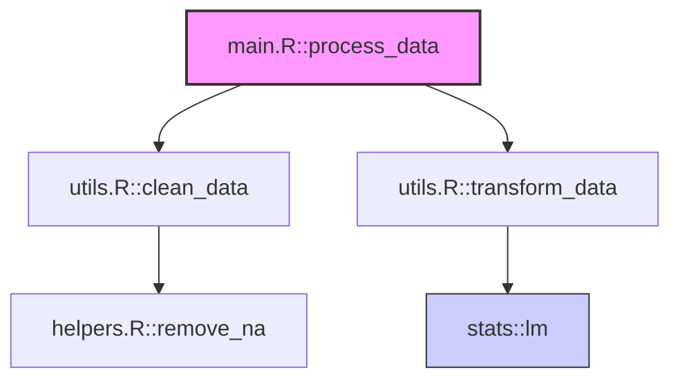

# 自动化代码仓库文档生成工具 - 用户手册（R语言与Mermaid调用关系图增强版）

## 1. 工具概述

本工具是一个专为R语言代码仓库设计的自动化文档生成系统，它结合了R语言静态分析、大语言模型和Quarto框架，能够自动为代码仓库生成全面的文档，并通过Mermaid图表可视化展示函数和模块之间的调用关系。

### 主要功能

- 自动分析R代码仓库结构，提取函数、类和其他代码元素
- 使用大语言模型为代码元素生成详细文档说明
- 通过Mermaid语法生成函数调用关系图，直观展示代码结构
- 将所有内容整合到美观的Quarto文档中，支持HTML、PDF等多种输出格式
- 支持本地文件系统和Git仓库作为代码源

## 2. 环境配置

### 系统要求

- R 4.0.0 或更高版本
- Quarto CLI 1.0.0 或更高版本
- 以下R包依赖：
  - CodeDepends（用于静态分析）
  - tidyllm（用于LLM集成）
  - jsonlite（用于配置处理）
  - git2r（用于Git仓库支持）
  - httr（用于API通信）
  - stringr（用于文本处理）
  - argparse（用于命令行参数）
  - quarto（用于文档渲染）

### 安装步骤

1. 安装R环境（如果尚未安装）：
   ```bash
   # Ubuntu/Debian
   sudo apt-get update
   sudo apt-get install -y r-base r-base-dev
   
   # CentOS/RHEL
   sudo yum install -y R
   
   # macOS (使用Homebrew)
   brew install r
   ```

2. 安装Quarto CLI：
   从[Quarto官网](https://quarto.org/docs/get-started/)下载并安装适合您系统的版本。

3. 安装R包依赖：
   ```R
   # 使用install_dependencies.R脚本自动安装所有依赖
   Rscript install_dependencies.R
   
   # 或手动安装
   install.packages(c("CodeDepends", "jsonlite", "httr", "stringr", "argparse", "quarto", "git2r"))
   # 对于tidyllm，可能需要从GitHub安装
   remotes::install_github("tidyverse/tidyllm")
   ```

## 3. 配置文件说明

工具使用JSON格式的配置文件来控制文档生成过程。以下是配置文件的主要参数：

```json
{
  "code_source": {
    "local_path": "/path/to/your/code",  // 本地代码路径，与git_repo二选一
    "git_repo": "https://github.com/user/repo",  // Git仓库URL，与local_path二选一
    "language_hints": ["R"]  // 代码语言提示，默认为R
  },
  "llm_settings": {
    "api_provider": "openai",  // API提供商，支持openai、siliconcloud等
    "api_base_url": "https://api.openai.com/v1",  // API基础URL
    "api_key_env_var": "OPENAI_API_KEY",  // 存储API密钥的环境变量名
    "model": "gpt-3.5-turbo",  // 使用的模型名称
    "max_tokens_per_request": 150,  // 每个请求的最大token数
    "temperature": 0.2,  // 生成温度，越低越确定性
    "rate_limit_delay_sec": 1,  // 请求间延迟，避免触发速率限制
    "token_limit": 5000  // 总token消耗限制
  },
  "output_dir": "/path/to/output",  // 输出目录
  "output_filename_base": "documentation",  // 输出文件名基础
  "quarto_format": "html",  // 输出格式，支持html、pdf等
  "project_name": "My R Project"  // 项目名称，用于文档标题
}
```

## 4. 使用方法

### 基本用法

1. 准备配置文件（如`config.json`）
2. 运行主脚本：
   ```bash
   Rscript R/main.R --config path/to/config.json
   ```
3. 查看生成的文档（默认位于配置的`output_dir`目录）

### 示例

```bash
# 为本地R项目生成文档
Rscript R/main.R --config config/local_project_config.json

# 为GitHub上的R仓库生成文档
Rscript R/main.R --config config/github_repo_config.json
```

## 5. Mermaid调用关系图功能

本工具的一个核心特性是使用Mermaid语法生成函数调用关系图，直观展示代码结构和依赖关系。

### 调用关系图特性

- 自动识别R函数之间的调用关系
- 支持跨文件的函数调用追踪
- 区分内部函数调用和外部包函数调用
- 通过图形化展示帮助理解代码结构和流程

### 调用关系图示例



## 6. 高级用法

### 自定义LLM提供商

工具默认支持OpenAI API，但也可以配置为使用其他兼容的API提供商：

```json
"llm_settings": {
  "api_provider": "siliconcloud",
  "api_base_url": "https://api.siliconflow.cn/v1",
  "api_key_env_var": "SILICONCLOUD_API_KEY",
  "model": "Qwen/Qwen3-235B-A22B"
}
```

### 控制Token消耗

对于大型代码库，可以通过以下设置控制LLM的token消耗：

```json
"llm_settings": {
  "max_tokens_per_request": 100,  // 减少每个函数文档的长度
  "token_limit": 3000,  // 设置总体token限制
  "rate_limit_delay_sec": 2  // 增加请求间隔
}
```

### 自定义Quarto输出

可以通过修改`quarto_renderer.R`中的模板来自定义文档样式和结构。

## 7. 故障排查

### 常见问题

1. **依赖安装失败**
   - 确保系统有正确的开发库：`sudo apt-get install libcurl4-openssl-dev libssl-dev libgit2-dev libxml2-dev`
   - 使用`install_dependencies.R`脚本安装所有依赖

2. **Git仓库克隆失败**
   - 检查Git URL是否正确
   - 确保网络连接正常
   - 对于私有仓库，可能需要配置认证

3. **LLM API调用失败**
   - 验证API密钥是否正确设置在环境变量中
   - 检查API基础URL是否正确
   - 确认网络可以访问API服务

4. **调用关系图为空或不完整**
   - 检查代码是否符合标准R函数定义格式
   - 非标准函数定义（如S3/S4方法）可能不会被完全识别
   - 大型代码库可能需要增加处理时间和内存限制

5. **Quarto渲染失败**
   - 确保Quarto CLI已正确安装并在PATH中
   - 检查生成的.qmd文件是否有语法错误

### 日志和调试

- 主脚本会输出详细的进度信息
- 检查控制台输出中的警告和错误信息
- 对于更详细的调试，可以修改源代码添加更多的`cat()`或`print()`语句

## 8. 局限性和已知问题

1. **R语言特定限制**
   - S3/S4方法和泛型函数的识别可能不完整
   - 非标准评估和元编程模式可能导致调用关系不准确
   - 匿名函数和闭包的处理有限

2. **大型代码库考虑**
   - 大型仓库可能导致调用图过于复杂，影响可读性
   - 处理大型代码库时可能需要更多内存和处理时间
   - LLM token消耗会随代码库大小线性增长

3. **Mermaid图表限制**
   - 复杂的调用关系可能导致图表难以阅读
   - 超过一定复杂度的图表可能无法正确渲染
   - 某些浏览器可能对大型Mermaid图表支持有限

## 9. 未来改进方向

1. **增强R语言分析**
   - 改进S3/S4方法和泛型函数的识别
   - 支持更多R特有的编程模式

2. **调用图优化**
   - 实现调用图分层和分组，提高大型代码库的可读性
   - 添加交互式筛选和搜索功能

3. **LLM集成增强**
   - 支持更多LLM提供商和模型
   - 实现更智能的token分配策略
   - 添加代码质量和改进建议功能

4. **文档定制**
   - 提供更多Quarto模板和主题选项
   - 支持更多输出格式和定制选项

## 10. 贡献和支持

本工具是开源项目，欢迎贡献和改进。如有问题或建议，请通过以下方式联系：

- 提交GitHub Issues
- 发送电子邮件至维护者
- 参与社区讨论

感谢使用本工具！
